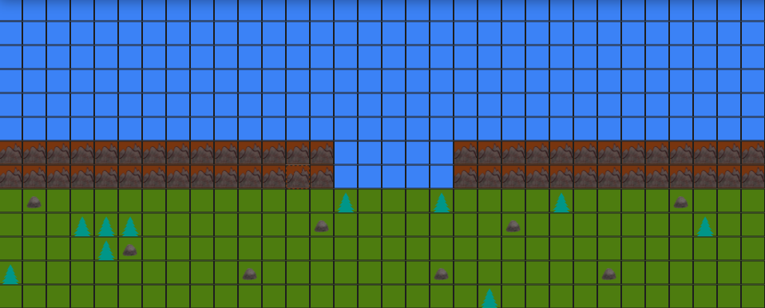

# Map Maker

I'm creating a game with Godot but I have to learn Godot first, but there are aspects of a game I know I want to make that I want to plan, such as the map. So, I created this lightweight map maker tool so I can play around with some map designs.





<br>
<br>

___

# Svelte + TS + Vite

This template should help get you started developing with Svelte and TypeScript in Vite.

## Recommended IDE Setup

[VS Code](https://code.visualstudio.com/) + [Svelte](https://marketplace.visualstudio.com/items?itemName=svelte.svelte-vscode).

## Need an official Svelte framework?

Check out [SvelteKit](https://github.com/sveltejs/kit#readme), which is also powered by Vite. Deploy anywhere with its serverless-first approach and adapt to various platforms, with out of the box support for TypeScript, SCSS, and Less, and easily-added support for mdsvex, GraphQL, PostCSS, Tailwind CSS, and more.

## Technical considerations

**Why use this over SvelteKit?**

- It brings its own routing solution which might not be preferable for some users.
- It is first and foremost a framework that just happens to use Vite under the hood, not a Vite app.

This template contains as little as possible to get started with Vite + TypeScript + Svelte, while taking into account the developer experience with regards to HMR and intellisense. It demonstrates capabilities on par with the other `create-vite` templates and is a good starting point for beginners dipping their toes into a Vite + Svelte project.

Should you later need the extended capabilities and extensibility provided by SvelteKit, the template has been structured similarly to SvelteKit so that it is easy to migrate.

**Why `global.d.ts` instead of `compilerOptions.types` inside `jsconfig.json` or `tsconfig.json`?**

Setting `compilerOptions.types` shuts out all other types not explicitly listed in the configuration. Using triple-slash references keeps the default TypeScript setting of accepting type information from the entire workspace, while also adding `svelte` and `vite/client` type information.

**Why include `.vscode/extensions.json`?**

Other templates indirectly recommend extensions via the README, but this file allows VS Code to prompt the user to install the recommended extension upon opening the project.

**Why enable `allowJs` in the TS template?**

While `allowJs: false` would indeed prevent the use of `.js` files in the project, it does not prevent the use of JavaScript syntax in `.svelte` files. In addition, it would force `checkJs: false`, bringing the worst of both worlds: not being able to guarantee the entire codebase is TypeScript, and also having worse typechecking for the existing JavaScript. In addition, there are valid use cases in which a mixed codebase may be relevant.

**Why is HMR not preserving my local component state?**

HMR state preservation comes with a number of gotchas! It has been disabled by default in both `svelte-hmr` and `@sveltejs/vite-plugin-svelte` due to its often surprising behavior. You can read the details [here](https://github.com/rixo/svelte-hmr#svelte-hmr).

If you have state that's important to retain within a component, consider creating an external store which would not be replaced by HMR.

```ts
// store.ts
// An extremely simple external store
import { writable } from 'svelte/store'
export default writable(0)
```
